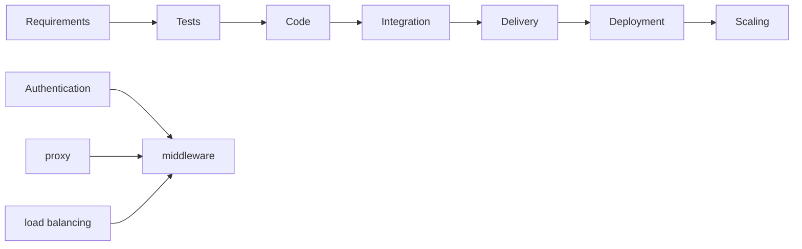

---
tags:
  - T4
  - MAD1
  - W12
date: 2025-04-24 14:40
cssclasses:
  - center-images
  - center-titles
---

Links:

GAA=100
Qz1= 88
Qz2=82
ET=75

## Service Approach
Permanent Deployment: auto-restart servers, Always-on internet, uninterrupted power, monitoring logging

- Content Delivery Network CDN to download bootstrap popular so `cached in browser`
- [[HTTPS]] secure certificate + **Load balancer**: multiple frontends so ❌wait
	- **Logging** (debug/security)
	- **Frontend** (↑bandwidth & kernel tune ↑$\#$connection requests→ DNS name → permanent network address → UPS
		- [[Database]]↑ RAM+disk

- Data center → infrastructure

#### Software-as-a-Service SaaS
- online office platforms `google docs, spreadsheets, office 365`
- content management systems `drupal, wordpress`
- Issue tracking `Trello, redmine`
Hosted solutions: all software is **installed** (up-to-date) & **maintained** for you

#### Infrastructure-as-a-Service (IaaS)
- raw/virtual machines **infrastructure**
- ✅ power, networking 
- Install your own OS
	- Manage **OS upgrades, security patches, software updates**
- `AWS, Google Compute Engine, Azure, DigitalOcean, Linode`
- computer interface taken care somewhere else, but data you put, manage, mess it up → crash is your problem

### Platform PaaS
combo of **hardware**(computing power, RAM, disk, network) + **software** (OS version, auto updates, security, firewalls)
- **Base Applications**: `py+Flask, RoR, PHP6Laravel` maintain multiple vers, security updates
- We focus on `code` & specify server sizing `lscpu`, DB, connectivity `free -m`
	- [[version control]], continuous integration & deployment, scaling & automation
- combine inputs from developer + provider → scaling
- Ex: `Replit, GAE, AWS, ElasticBeanStalk, Heroku`

### Version Control
- manage changes to code → backups of old code → new features branch → collaborate → fix bugs

- **Centralized** server for many clients (push changes each time) , check in → lock files (❌ multiple editors on same file) → check-out → unlock → merge
- **Distributed** changes managed by "patches" - email, merge requests
- `github, gitlab` centralized on top of distributed

> [!NOTE] ### Continuous integration CI
> practice of automating the integration of code changes from **multiple contributors** into a single software project.
> - multiple authors → different parts of code through **central build server** `pull`→ automated tests on `push` → auto-compiles code.

#### Best Practices
- Write tests before code on each `push` to server
- Pull & merge requests `gitlab` *correct, cleanliness, style*

#### Continuous Delivery/Deployment CD
- Once CI✅ passed **Delivery**→ auto "release package" after ✅tests →  up-to-date *beta/nightly build*
- Web **Deployment**: passed tests → immediate fix-upgrades → Automatically latest features deployed to **production**(users) (latest ver ❌ install new ver or update code/servers) → Tests may ❌ catch all problems

## Containers
- ❌ possible Full OS, software, versions → [[version control]]
**self-contained environment with OS**, minimal libraries - just enough to run process
- Linux kernel → control groups → namespaces `2008`→ prevent this process/ image   from effecting others [[sandbox]] **isolation**
- `chroot` custom filesystem for part of code ❌ real process isolation 70s
- `FreeBSD jails, Linux VServer, OpenVZ` same-kernel, different file systems
- Kernel level support - inter-container networking→ directly talks to hardware & manage resources
- `Docker` managing images ✅ containers (difficult [[version control]], bad practices)

#### Orchestration
- multiple processes → start in specific order (dependencies) → isolated communication between processes → build, orchestrate, automate `kubernutes, docker-compose` → large-scale deployments

## Github

- **Branches**
  - Isolate new features or bug fixes without affecting the main codebase.
  - Merge changes back into the main branch after testing.
- **Pull Requests**
  - Propose changes to the codebase.
  - Enable collaborative review and discussion before merging.
- **Commits**
  - Save specific code changes with a descriptive message.
  - Create a detailed history of project progress.
- **Issues**
  - Used for tracking bugs, feature requests, and tasks.
  - Promote organized project management.
  - Actions: Automate workflows such as building, testing, and deploying code.
