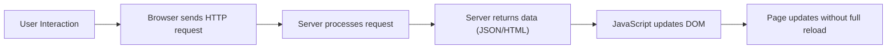

# Asynchronous Updates

Modern web applications aim to provide responsive and interactive user experiences. This is achieved through asynchronous communication techniques, which allow parts of a webpage to update without reloading the entire page.

- Allows **partial page updates**, where only required data is fetched and specific sections of the page are updated without a full reload.
- load minimal data in *background* after main page has been loaded and rendered.
- `AJAX` refresh enables browser to send async requests and receive only the required data (typically JSON).
- A user selects an `clothes category` from a form
- The browser requests only the `cloth category` data (not full HTML)
- A specific `<div>` is updated dynamically

**Asynchronous (Non-blocking):**

```javascript
async function fetchData() {
  try {
    console.log("Fetching data...");

    // Send request to server (non-blocking)
    const response = await fetch("https://example.com/data");

    // Convert response to JSON
    const data = await response.json();
    console.log("Data received:", data);
  } catch (error) {
    console.error("Error fetching data:", error);
  }
}

// Call function
fetchData();

// This runs immediately (does NOT wait)
console.log("This runs before data is received");
```

#### Key Advantages
- Improved user experience (no full-page reloads)
- Reduced bandwidth usage
- Faster perceived performance
- Enables real-time and interactive applications


## Synchronous (Blocking)

```javascript
function fetchData() {
  let response = fetch('https://mad1.com/data');
  console.log("Data fetched!");
}
```
⚠️ Modern JavaScript APIs such as `fetch` are asynchronous by default. True **blocking** behavior is rare and discouraged in browsers.


| Feature         | **Synchronous (Blocking)**      | **Asynchronous (Non-blocking)** |
| --------------- | ------------------------------- | ------------------------------- |
| **Execution**       | one task at a time (blocking as `task 2` has to wait for `task 1` to finish)| execute independently, multiple at once (non-blocking)    |
| **User Experience** | UI may freeze while waiting     | UI remains responsive           |
| **Use Case**        | Simple quick operations               | API calls, background updates   |

##### Real-world Analogy
Synchronous: Waiting at a counter until your order is ready<br>
Asynchronous: Ordering food and receiving a notification when ready

## Asynchronous Communication Techniques

:::warning 1. AJAX (Asynchronous JavaScript and XML)

- A technique for sending and receiving data asynchronously between client and server
- Enables partial page updates without full reload
- Typically uses JSON instead of XML in modern applications

**Example Use Cases:**
- Loading comments dynamically
- Auto-complete search suggestions
- Updating dashboards
:::


:::tip 2. WebSockets

- Provides **full-duplex communication** over a single TCP connection
- Enables real-time data exchange between client and server

**Ideal for:**
- Chat applications
- Live notifications
- Online gaming
- Financial dashboards
:::

- **AJAX** follows a **request–response** model
- **WebSockets** provide **persistent, two-way communication**

## [DOM (Document Object Model)](https://developer.mozilla.org/en-US/docs/Web/API/Document_Object_Model)

The **Document Object Model (DOM)** is a programming interface that represents a web page. It provides an abstract model of the document, allowing programs to access and modify content, structure, and style dynamically.
It's flexible but also increases frontend complexity, especially in large applications.

### Key Features of DOM Manipulation

1. **API-Based Access**: Provides methods such as:
    - `querySelector()`
    - `querySelectorAll()`
    - `getElementById()`
2. **Dynamic Content Updates**: Elements can be created, modified, or removed at runtime
3. **Integration with JavaScript**: JavaScript interacts with the DOM to enable dynamic UI updates
    - composition, inheritance (parent-child)
    - loops, iterators
4. **Styling Integration**
   Works alongside CSS to control visual presentation


### Example: DOM Manipulation

```js
document.querySelector("button").addEventListener("click", () => {
    // document.getElementsByTagName("h2") returns a NodeList of the <h2>
  // elements in the document, and the first is number 0:
  const header = document.querySelector("h2");
  header.textContent = "A dynamic document";

  // The firstChild of the header is a Text node:
  const newPara = document.createElement("p");
    newPara.textContent = "This is the second paragraph.";

    document.body.appendChild(newPara);
  // Now header is "A dynamic document".
  // Access the first paragraph
  // Create a new Text node for the second paragraph
  const newText = document.createTextNode("This is the second paragraph.");

  // Create a new Element to be the second paragraph
  const newElement = document.createElement("p");

  // Put the text in the paragraph
  newElement.appendChild(newText);

  // Put the paragraph on the end of the document by appending it to
  // the body (which is the parent of para)
  para.parentNode.appendChild(newElement);
});
```
<DOMNotice />

You will learn more DOM code in [Week 11](../week11/11-Beyond-HTML.md)

## Browser–Server Interaction (Asynchronous Flow)


Minimum browser requirements:
- Render HTML content
- Handle cookies for session management

## Additional Frontend Capabilities

#### 1. Canvas API

- Allows drawing graphics and animations directly in the browser
- Used in games, data visualization, and simulations


#### 2. Offline Web Storage

- Enables storing data locally in the browser
- Technologies include:

  - `localStorage` (persistent)
  - `sessionStorage` (temporary)

You will learn more about this in MAD2 course.
#### 3. Drag and Drop API

- Allows users to interact with elements visually by dragging and dropping
- Common in file uploads and UI builders


### Request Flow

1. Client sends HTTP request
2. Web server forwards request to WSGI application
3. The app receives:
   - `environ` → info about the request (URL, method, etc.)
   - `start_response` → function to start sending a response
4. The app processes the request and sends back data to the server.
5. The server sends it to the browser.

#### Accessibility & Best Practices

- Follow **World Wide Web Consortium (`W3C`)** accessibility guidelines
  - Do not rely solely on color or visual cues
  - Separate structure (`HTML`), style (`CSS`), and behavior (`JavaScript`). Gives freedom to browser (user)
- Ensure compatibility with different browsers and devices


::: details WSGI Components **Web Server Gateway Interface**
Server-side frameworks like `Flask` use standards like `WSGI` to process requests and generate responses
- [Apache vs Nginx resource](https://serverguy.com/apache-vs-nginx/)

| Component            | Description                                                     | Example                           |
| -------------------- | --------------------------------------------------------------- | --------------------------------- |
| **Web Server**       | Receives requests from users and sends them to the app   | `Apache, Nginx, Gunicorn`           |
| **WSGI Application** | The Python code that processes the request logic | `Flask/Django app`                  |
| **Middleware**       | Adds additional processing between server and app | Authentication, logging, compression, etc. |


| Benefit                     | Description                                      |
| --------------------------- | ------------------------------------------------ |
| **Framework Compatibility** | Works with Django, Flask, Pyramid, etc.          |
| **Flexibility**             | Middleware can add login systems, sessions, etc. |
| **Scalability**             | Can handle many users at once efficiently        |


### Example WSGI Code

```python
def simple_app(environ, start_response):
    status = '200 OK'
    headers = [('Content-Type', 'text/plain')]
    start_response(status, headers)
    return [b"Hello, WSGI World!"]
```
:::

