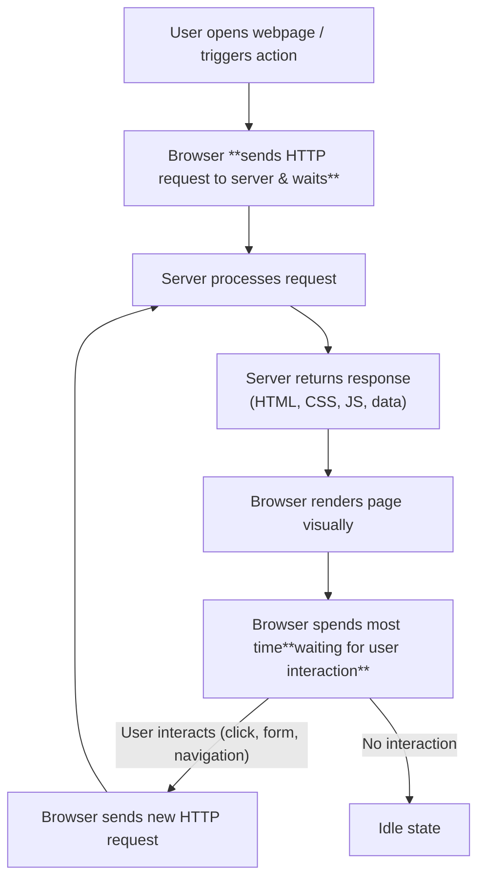

# Frontend Fundamentals (HTML/CSS/JS)
The frontend is the part of an application that users directly interact with. It is responsible for presenting data and handling user interactions.

1. Display visuals and layouts that users see (receive data from server)
2. Handling user inputs like *clicks, typing* and navigating to the desired page. (send data to server)
3. Communicating with the backend – sending and receiving data via HTTP requests

- Frontend interfaces can include:
  - Graphic User Interface desktop software
  - Web browser-based **client**
  - custom embedded interface (for specific device hardware)
- **Device/OS-specific interfaces**: UI elements may differ across operating systems (Windows, Android, iOS)
- Browsers follow common standards (HTML, CSS, JavaScript) to ensure consistent rendering across platforms
- **Browser-based apps** rely on web standards
- **Native apps** use platform-specific APIs and provide tighter system integration
## Components of Web Frontend Development

:::info HTML: **what to show?** 
Defines the structure of a web page, such as headings, paragraphs, lists, tables, and forms.
:::

:::info CSS: **how to show?** 
Controls the visual presentation of a webpage
- controls layout, colors, spacing and visual design
- Separation of HTML (structure) and CSS (style) improves flexibility
- Enables better accessibility and adaptability across devices
:::

:::warning Javascript: Enables **dynamic behaviour and interactivity** UX
-  Manipulating HTML elements `buttons, links, forms`
- Handles user interactions (clicks, input, navigation)
- Updating page content without reloading (dynamic UI updates)
- Communicating with servers using APIs (e.g., via `fetch` or `AJAX`)
- No machine-endpoints `APIs`: embedded devices (small web client does not have own network protocol → server→ local temperature sensor `HTTP  JS`)
- Other languages (e.g., Python via `Brython`, `PyScript`) exist but are less common
- **Transpilation** refers to converting code written in one language (e.g., TypeScript) into JavaScript so it can run in browsers.

1. Chrome/Edge/Brave: `V8` JavaScript Engine
2. Firefox: `SpiderMonkey`
3. Safari: `JavaScriptCore` 
In advanced use cases, JavaScript can also run on the server (e.g., `Node.js`)
:::

- **Server-Side Rendering (SSR)**: The server generates fully formed HTML pages (e.g., using templating engines like Jinja2 in Flask or Django Templates) and sends them to the browser for immediate display.
- **Client-Side Rendering (CSR)**: The browser initially loads a minimal HTML shell, and JavaScript dynamically fetches data (typically via APIs returning JSON) to render content in the browser.

:::warning **SSR** improves initial load performance and SEO, while   **CSR** enables richer interactivity and smoother user experiences after load.
:::

## 1. client-side scripting

Client-side scripting uses JavaScript in the browser to create dynamic behavior without requiring full page reloads.

| Advantages                   | Limitations                                  |
| ---------------------------- | -------------------------------------------- |
| Reduces server load | Depends on client device performance ( more resources on `client CPU/GPU`)         |
| Enables rich interactivity   | Security risks if sensitive logic is exposed to client |
| Works well with `static` sites | Requires careful API design                  |

- Supports reusable components via frameworks (e.g., `React, Angular, Vue`)

- **Machine client** using HTTP end-points: these machine may access APIs, `POST` sensor information to data collection sites (monitoring, time series analysis) 

## 2. server-side rendering: Run-time HTML generation 
HTML is generated dynamically when a user accesses the page
- Traditional CGI/Web-Services Gateway Interface `WSGI` based apps
- Python frameworks (Flask, Django)
- Ruby on Rails
- PHP-based systems
- Content Management Systems (e.g., WordPress, Joomla, Drupal)

| Advantages                                      | Limitations                           |
| ----------------------------------------------- | ------------------------------------- |
| Highly flexible and personalized                | Higher server load as every page has to be generated dynamically  |
| Supports user authentication and real-time data | Requires optimization (e.g., `caching`) |
| Easier to manage complex applications with *common layouts & themes* |could lead to more Database hits so higher costs💰 & can impact performance  |

- Dynamic pages support real-time customization such as user authentication, personalized content, and time-dependent data.
- Better control over sensitive data compared to client-side approaches.

## 1. Static pages
Static pages are pre-built HTML files that are served directly to users without modification.

→ Server simply delivers HTML files without dynamic processing by server 
→ All/most pages are generated ahead of time

| Advantages                                                                                                      | Limitations                                               |
| --------------------------------------------------------------------------------------------------------- | -------------------------------------------------- |
| High performance: server just picks up file & delivers |  Updates to static content require `redeploying` | 
| Easy to cache & distribute via CDNs | limited flexibility for personalized content |
| simple architecture | Limited support for dynamic interactions |

Modern static sites are often built using static site generators such as: `Jekyll, Hugo, Next.js, Gatsby`

## 2. Dynamic pages

Dynamic pages are generated at runtime on the server based on user input, database queries, or application logic.

## Original Web Model (Synchronous Page Reload)
In traditional web applications:
- client sends a request to the server
- server responds with a complete HTML page
- browser renders the entire page

For every update:
- A new request is sent
- The server returns a full page (HTML, CSS, JS)
- The browser re-renders everything from scratch

Limitations:
- High server load due to repeated full-page responses
- Redundant data transfer
- Slow updates due to full reloads

::: tip MODERN Browser Workflow to handle load

Modern browsers perform significant computation;to improve performance and interactivity (from [Original Web Model](#original-web-model-synchronous-page-reload)):

- More processing is shifted to the client:
  - `JavaScript` execution uses CPU
  - Graphics and animations may use GPU
  - May increase energy consumption & resource usage (slow your device like check `Task Manager`)
- This reduces server load and enables richer user experiences

##### optimization techniques
1. **Caching**: stores previously fetched data for faster access (to previously viewed data) and to reduce repeated requests
2. **Content Delivery Networks CDN**: Distribute content geographically to reduce latency
3. **Minification & Bundling**: Reduce file size for faster loading
4. **Lazy Loading**: Load resources only when needed
:::

## Summary

- **Content generation**: static build vs runtime rendering
- **Code reuse**: component-based frameworks improve maintainability
- **Performance**: balance between client and server workload
- **Security**: avoid exposing sensitive logic on the client

| Feature                   | Server-Side Rendering (SSR)           | Client-Side Rendering (CSR)            |
|---------------------------|----------------------------------------|----------------------------------------|
| First Page Load           | Faster                                 | Slower (needs extra round trips)       |
| SEO Friendliness          | High (content is ready in HTML)        | Lower (unless prerendering is used)    |
| Interactivity             | Requires full-page reloads or AJAX     | Dynamic updates without reloading      |
| Server Load               | Higher (renders full pages)            | Lower (renders data only)              |
| Complexity on Client      | Low                                    | High (JavaScript required)             |
| Template Logic Location   | Server                                 | Client                                 |
| Examples                  | `Flask`, `Django`                      | `React`, `Angular`, `Vue`              |

| Approach                  | Advantages                              | Limitations                                  |
| ------------------------- | --------------------------------------- | -------------------------------------------- |
| **Static Pages**          | Very fast, cache-friendly               | Limited personalization                      |
| **Server-Side Rendering** | Flexible, secure handling of data       | High server load                             |
| **Client-Side Rendering** | Highly interactive, reduces server work | Higher client resource usage, security risks |
