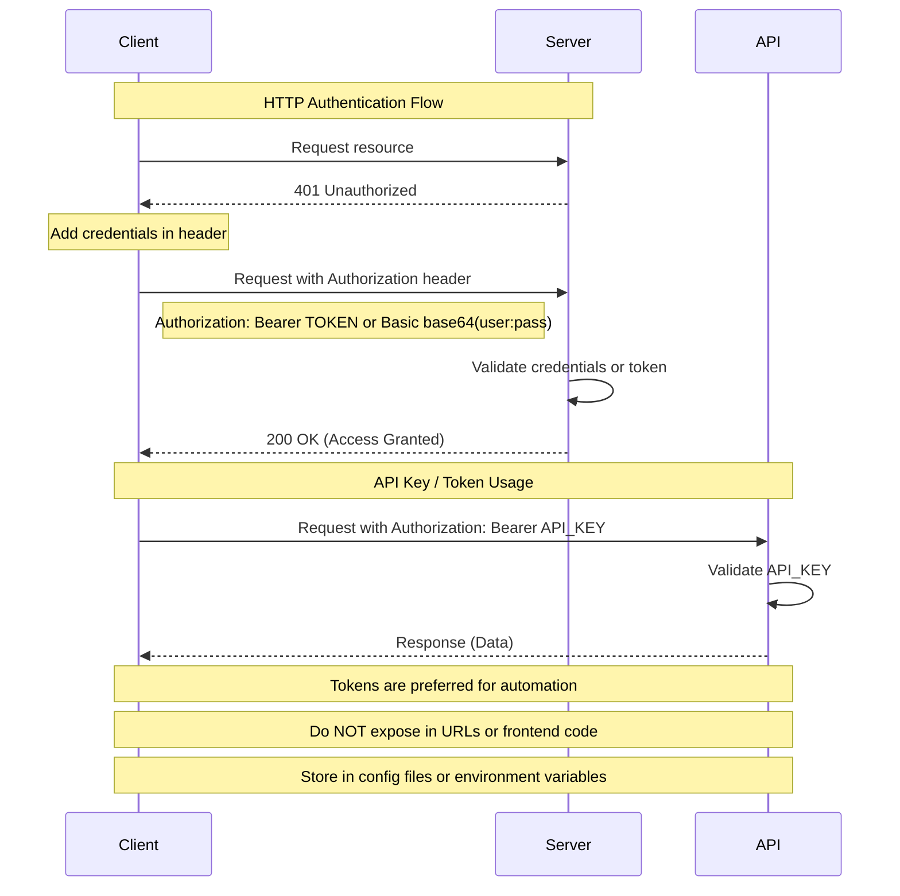

# Security

## Access Control


**Access control** is the mechanism that determines **who can access what resources** and **what actions they are allowed to perform**.

* **Access** includes:
  * `Read`-only: view data without making changes
  * `Write`: create or update data  
  * `Modify` existing-only (can't create new data)
  * `Read-write` [CRUD: Create, read, update, delete](../week5/5-CRUD-API.md#crud-operations)

Not all parts of a system should be publicly accessible. Sensitive data such as **personal address, financial transactions, or academic grades** must be protected.


### Models of Access Control
<div class="card">

  <h3>1. Discretionary Access Control (DAC)</h3>
  <p>
    These decisions are made by the <strong>owner of the resource</strong>.
  </p>
  <ul>
    <li>Users can grant or revoke access to others</li>
    <li>Flexible and user-controlled</li>
    <li>Simple static <strong>permission</strong> checks → less secure</li>
  </ul>

<span style="color:rgb(181, 118, 244)"><strong>Example:</strong> You create a Google Doc and decide who can view or edit it.</span>
</div>
<div class="card">

  <h3>2. Mandatory Access Control (MAC)</h3>
  <p>
    Access decisions are made by a <strong>central authority</strong>, not users.
  </p>
  <ul>
    <li>Users cannot share files or change permissions</li>
    <li>Information sharing is strictly controlled</li>
    <li>Highly secure, used in sensitive environments (e.g., military)</li>
  </ul>

  <span style="color:rgb(181, 118, 244)">
    <strong>Example:</strong> A government system where only authorized clearance levels can access classified documents.
  </span>

</div>
<div class="card">
  <h3>3. Role-Based Access Control (RBAC)</h3>
  <p>
    Access is assigned based on <strong>roles</strong>, not individual users.
  </p>
  <ul>
    <li>Users are assigned roles → roles define permissions</li>
    <li>Easy to manage</li>
    <li>Supports role hierarchy</li>
  </ul>
    <strong>Example:</strong> In a college fest:
    <br>Admin → full control  
    <br>Student → view own data  
    <br>Club Secretary → manage club events  
    <br>House Regional Coordinator → manage region student activities  
    <br>Admin → full control  

    A single user can hold multiple roles (e.g., Student + Club Secretary).  </span>

</div>
<div class="card">
  <h3>4. Attribute-Based Access Control (ABAC)</h3>
  <p>
    Access decisions are based on <strong>attributes and conditions</strong>.
  </p>
  <ul>
    <li>User attributes (age, role, department)</li>
    <li>Environmental attributes (time, location)</li>
    <li>Highly flexible and supports complex policies</li>
  </ul>

  <span style="color:rgb(181, 118, 244)">
    <strong>Example:</strong> An employee can access office systems only during working hours and only from office location.
  </span>

</div>


## Permissions

* Simple, **static** rules
* directly check: `User belongs to Admin group → allow access`

## Policies

* **Dynamic** and condition-based
* Combine multiple rules: `Must have aadhar + address of that district + age > 18 to get a driving license AND time within working hours of RTO`


# Principle of Least Privilege

Every user or system component should have **only the minimum access required** to perform its function.

* Improves **security**: limits damage in case of compromise
* More **stability**: reduces accidental modifications/deletes of **sensitive files**


## Privilege Escalation

User temporarily gains higher access rights.
* `sudo/su`: avoid continuous use of `root/administrator` accounts
* Maintain `logs` in **controlled** environment

## Layers of Access Control

- **Hardware** Level: Smart cards, biometric door locks

- **Operating System** Level: File permissions & Memory protection

- **Application** Level: Database access rules
- **Web Application Level**: Controllers via *decorators* in `@app.route Flask`

```python
@app.route('/admin')
@login_required
@role_required('admin')  # Decorator enforces access control before function execution
def admin_dashboard():
    return "Only admin can access" #Role-Based Access Control
```

> [!NOTE]
> **Admin**:*Create, update, delete records*
> **Student**:  *View only their own grades*


## Types of Security Checks

### 1. Obscurity
Security based on hiding implementation details. - Running a service on non-standard port known to specific ppl

> [!NOTE] 
> A web server runs on port `54321` instead of `80`.
> 
> - Only developers know this port. However, a simple port scan can reveal it, making the system exposed. 
> 
> This is not real security, just hiding.


### 2. Address-Based Control
- Access determined by where request comes from - access/deny based on **IP address**

> [!NOTE] 
> A company allows access to its admin dashboard only from office IP addresses.
> 
> If someone tries from outside (home/public network), access is denied even with correct credentials.

### 3. Login-Based Authentication

- **Login** requires username/password 
  - Passwords must be hashed, not stored in plain text directly in server
  - Most common authentication method

> [!NOTE] 
> When logging into an e-commerce site:
> 
> - You enter username/password
> - Server compares the hashed password, not the original password
> 
> Even if the database is leaked, raw passwords are not directly exposed.

### 4. Token-Based Authentication
- Access is granted using tokens instead of passwords.
  - Tokens are hard to guess or duplicate
  - Often used for APIs and machine-to-machine communication


> [!NOTE] 
> A mobile app logs in once and receives a token.For future requests, it sends:
> 
> `Authorization: Bearer <token>`
> 
> The user does not need to send their password again.

## HTTP Authentication
- Enforced by the server. Uses HTTP status codes
- **401 Unauthorized** → authentication required
- **403 Forbidden** → authenticated but not allowed
- **404 Not Found** → resource does not exist


## Authenticate Form submission
- **GET** data sent in URL. Can be easily intercepted or modified as stored in:
`/login?username=admin&password=1234`
  - browser history
  - logs
  - proxies
- **POST**: data sent in request body (not visible in URL)
	- form multipart data+ HTTPS = real security


> [!DANGER]
>  A single TCP connection can serve multiple HTTP requests
> - With `Keep-Alive` (persistent connections):
>   - One TCP connection reused
>   - Reduces overhead (no repeated handshakes)
>   *→ like staying on a phone call while asking multiple questions*
> - Without `Keep-Alive`:
>   - Each request = new TCP + re-authentication
>   - Higher latency and server load
>   *→ hanging up and calling again for every question*

## API key/token
Used primarily for machine-to-machine communication (APIs, CLI tools, services).
- In browsers `cookie` is preferred, `API` is send via `HTTP` header
- Sent in request headers
- Must be hard to guess, securely stored (`.env`) in environment variables & configuration files `config.py` 
- Tokens should have:
  - Expiration time (to limit misuse)
  - Revocation mechanisms (in case of compromise)

## Cryptographic function
### One-way function
cryptographic hash function transforms input into a fixed output.

easy to compute B from A: $f(A)=B$
Near impossible to compute A from 𝐵: $f^{-1}(B)=A$
`MD5 (deprecated), SHA1 (weak), SHA256 (modern)` 

### Nonce *number used only once* 
A unique value provided by the server to client, prevents replay attacks (ensure each request is unique). 

> [!NOTE] 
> 1. Server sends nonce
> 2. Client computes:
> ```
> HA1 = MD5(username:realm:password)
> HA2 = MD5(method:URI)
> Response = MD5(HA1:nonce:HA2)
> ```
> 3. Server verifies response
> Even if an attacker intercepts the request, they only see the final hash. Nonce ensures the same request cannot be reused.

## Client certificates
secure (irreversible) **cryptographic** certificates provided to each client 
- Client can provide this for the server to **handshake** exchange info 

> [!NOTE]
> In a corporate VPN:
> 
> Your device has a certificate
> Server verifies it before allowing access
> 
> No password required—identity is cryptographically proven.


## Summary

* Not all system components are publicly accessible
* Role-Based Access Control supports hierarchies
* Policies are dynamic; permissions are static
* Modify-only access allows editing but not creation
* Obscurity is not a reliable security mechanism
* Passwords must always be hashed
* `Base64` is encoding, not encryption
* GET is not secure for credentials
* Tokens are preferred for APIs and automation
