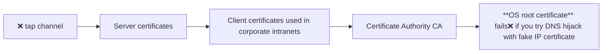

## Session Cookie 
A session stores state across multiple requests:
- Logged-in status
- Preferences
- Permissions (allow this site every time)
Cookies are used to store a session identifier that links the client to server-side session data.
Server sends:

```txt
Set-Cookie: <cookie-name>=<cookie-value>; Domain=<domain>; Secure; HttpOnly
```

- Logout requires:
  - Invalidating the session on the server
  - Removing the session cookie from the client
- client must send cookies back with every subsequent request

## Types of Session Storage
1. **Client-Side Session**: Entire data stored in cookie but can be modified by user
- Not sensitive(font, light/dark mode) can be on <span style="font-weight:bold; color:rgb(181, 118, 244)"> client side </span>  (can modify/access)
2.  **Server-Side Session**: Cookie stores only session ID. Actual data stored on server
  - ✅Sensitive(user permissions, session tokens) stored on the <span style="font-weight:bold; color:rgb(181, 118, 244)"> server side </span> and referenced using an identifier (stored in a cookie) 
  - Backend options:
    - Database
    - File storage
    - `redis cache key-value stores`
  
## Cookie Theft
If a session cookie is stolen, an attacker can impersonate the user.

Mitigation techniques:
- Session timeouts
- Secure and HttpOnly cookie flags
- Binding session to IP address

## Cross-Site Request Forgery (CSRF)

An attacker tricks a user into sending unintended requests to a trusted site where the user is authenticated.

:::info Example

1. User logs into a banking website  
2. Attacker sends a malicious link or embeds a hidden request  
3. Browser automatically sends the request using the existing session cookie  

→ Money transfer happens without user intent

Solution:
- Use CSRF tokens
- Validate request origin on the server *verify on server that legitimate start point*

:::


```python
from flask_login import login_required, current_user, logout_user, login_user

app.secret_key ='_5#y2L"F4Q8z/n/xec]/'

@app.route('/')
def index():
    if 'username' in session:
        return f'Logged in as {session['username']}'
    return 'You are not logged in'

@app.route('/login', methods=['GET', 'POST'])
def login():
    if request.method == 'POST':
        session['username'] = request.form['username']
        return redirect(url_for('index'))
    return '''
    <form method="post">
        <input type="text" name="username">
        <input type="submit" value="Login">
    </form>
    '''

@app.route('/profile')
@login_required
def profile():
    return f'Welcome back {current_user.name}'

@app.route('/logout')
@login_required
def logout():
    logout_user()
    session.clear()
    return redirect(url_for('index'))
```

## HTTPS
- Problem with HTTP: open connection to server on fixed network port `default 80` and data is visible + modifiable
Encrypts all **physical wire** communications using **TLS/SSL** protocols

:::HTTPS **secure sockets** encrypted channel
Data encrypted using a shared secret key  `long binary string KEY`
Without key → unreadable (`XOR` all input data with key to generate new binary encrypt text)
### TLS Handshake
1. Client connects
2. Server sends its digital certificate  
3. Client verifies certificate using trusted authorities  
4. Key exchange mechanism establishes a shared secret  
5. Secure encrypted communication begins  

### Server Authentication
Prevents: DNS hijacking (false IP address) or fake servers

- Uses chain of trust:
    - **Server certificate**
    - **Certificate Authority (CA)**
    - **Root certificate** (stored in OS/browser)



| Advantages | Limitations |
|-----------|------------|
| Confidentiality (data cannot be read by attackers) | Performance overhead due to encryption |
| Integrity (data cannot be altered in transit) | Reduced effectiveness of proxy caching |
| Authentication (server identity verified) | Compatibility issues with outdated systems |

- **Client or OS root** could be stolen certificates → revocate → ensure OS, browser update **trust stores**


Wildcard Certificates
1 certificate that secures all subdomains of a domain
Example (not actual google certificate implementation): `*.google.com` covers all subdomains like `docs.google`, `maps.google` and `mail.google`
- If compromised → all subdomains affected


## Logging
Logging is the process of recording events, activities, and accesses within an application or system.

- Stores information like requests, errors, user actions
- Helps track system behavior over time

### Why is Logging Important?
- **Debugging**: identify bugs and errors quickly
- **Usage Analytics**: understand user behavior and traffic patterns
- **Performance Optimization**: detect bottlenecks and improve efficiency
- **Security Monitoring**: identify suspicious or malicious activities

### Server-level Logging

Built into web servers like `Apache HTTP Server & Nginx` to log:
- URLs accessed: detect malformed or suspicious requests  
- Request rates: identify abnormal spikes or repeated failures  
- IP addresses: monitor repeated access attempts to restricted endpoints  
- Status codes

### Application-level Logging
Python logging framework logs include:
- Controller & database interactions
- Errors and exceptions
- Security-related events

### Log Rotation
Logs grow very large → storage issues:
1. keep last $N$ files
2. delete oldest file(less space overhead)
3. rename $\log.i \to \log.i+1$

### Logging in Cloud Platforms
- Automatic log collection
- Usage analytics
- `Google App Engine` gives performance-usage reports, automated security analyses on `log`

### Time-Series Analysis
Logs include timestamps, so we can analyze:
1. **Event Density**
- Events per second (requests/sec)
2. **Pattern Detection**
- Periodic spikes
- Sudden traffic surges
3. **Incident Analysis**
- Identify exact time of failure or attack
- Time-series Database: `RRDTool, InfluxDB, Prometheus` query trends and metrics
