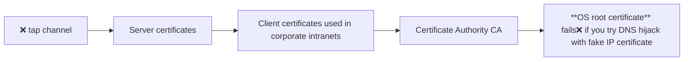

## HTTPS
- Problem with HTTP: open connection to server on fixed network port `default 80` and data is visible + modifiable
Encrypts all **physical wire** communications using **TLS/SSL** protocols

>[!DANGER] HTTPS **secure sockets** encrypted channel
> Data encrypted using a shared secret key  `long binary string KEY`
> Without key → unreadable (`XOR` all input data with key to generate new binary encrypt text)

    
### TLS Handshake
1. Client connects
2. Server sends its digital certificate  
3. Client verifies certificate using trusted authorities  
4. Key exchange mechanism establishes a shared secret  
5. Secure encrypted communication begins  

### Server Authentication
Prevents: DNS hijacking (false IP address) or fake servers

- Uses chain of trust:
    - **Server certificate**
    - **Certificate Authority (CA)**
    - **Root certificate** (stored in OS/browser)

| Advantages | Limitations |
|-----------|------------|
| Confidentiality (data cannot be read by attackers) | Performance overhead due to encryption |
| Integrity (data cannot be altered in transit) | Reduced effectiveness of proxy caching |
| Authentication (server identity verified) | Compatibility issues with outdated systems |

- **Client or OS root** could be stolen certificates → revocate → ensure OS, browser update **trust stores**

Wildcard Certificates
1 certificate that secures all subdomains of a domain
Example (not actual google certificate implementation): `*.google.com` covers all subdomains like `docs.google`, `maps.google` and `mail.google`
- If compromised → all subdomains affected

## Logging
Logging is the process of recording events, activities, and accesses within an application or system.

- Stores information like requests, errors, user actions
- Helps track system behavior over time

### Why is Logging Important?
- **Debugging**: identify bugs and errors quickly
- **Usage Analytics**: understand user behavior and traffic patterns
- **Performance Optimization**: detect bottlenecks and improve efficiency
- **Security Monitoring**: identify suspicious or malicious activities

### Server-level Logging

Built into web servers like `Apache HTTP Server & Nginx` to log:
- URLs accessed: detect malformed or suspicious requests  
- Request rates: identify abnormal spikes or repeated failures  
- IP addresses: monitor repeated access attempts to restricted endpoints  
- Status codes

### Application-level Logging
Python logging framework logs include:
- Controller & database interactions
- Errors and exceptions
- Security-related events

### Log Rotation
Logs grow very large → storage issues:
1. keep last $N$ files
2. delete oldest file(less space overhead)
3. rename $\log.i \to \log.i+1$

### Logging in Cloud Platforms
- Automatic log collection
- Usage analytics
- `Google App Engine` gives performance-usage reports, automated security analyses on `log`

### Time-Series Analysis
Logs include timestamps, so we can analyze:
1. **Event Density**
- Events per second (requests/sec)
2. **Pattern Detection**
- Periodic spikes
- Sudden traffic surges
3. **Incident Analysis**
- Identify exact time of failure or attack
- Time-series Database: `RRDTool, InfluxDB, Prometheus` query trends and metrics
